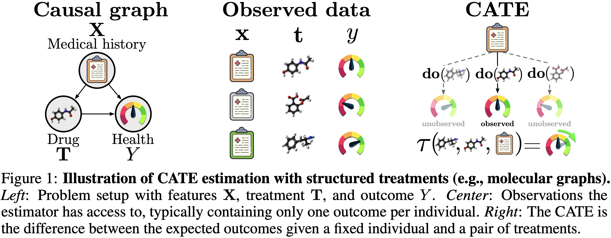

# Causal Effect Inference for Structured Treatments


We address the estimation of conditional average treatment effects (CATEs) for structured treatments (e.g., graphs, images, texts). Given a weak condition on the effect, we propose the generalized Robinson decomposition, which (i) isolates the causal estimand (reducing regularization bias), (ii) allows one to plug in arbitrary models for learning, and (iii) possesses a quasi-oracle convergence guarantee under mild assumptions. In experiments with small-world and molecular graphs we demonstrate that our approach outperforms prior work in CATE estimation.

[Link to paper](https://arxiv.org/abs/2106.01939)

# Requirements

We tested the implementation in Python 3.8.

## Dependencies

`requirements.txt` is an automatically generated file with all dependencies.

Essential packages include:

```
rdkit
numpy
networkx
scikit-learn
torch
pyg
wandb
```

## Datasets

The TCGA simulation requires the TCGA and QM9 datasets. The code automatically downloads and unzips these datasets if
they do not exist. Alternatively, the TCGA dataset can be downloaded
from [here](https://drive.google.com/file/d/1P-smWytRNuQFjqR403IkJb17CXU6JOM7/view?usp=sharing) and the QM9 dataset
from [here](http://deepchem.io.s3-website-us-west-1.amazonaws.com/datasets/gdb9.tar.gz). Both datasets should be located
in `data/tcga/`.

# Entry points

There are three runnable python scripts:

* `generate_data.py`: Generates and saves a dataset given the configuration in `configs/generate_data/`.
    * Stores generated data in `data_path` with folder structure `{data_path}/{task}/seed-{seed}/bias-{bias}/`
    * For each `task`, `seed`, and `bias` combination, generates and stores a new dataset
* `run_model_training.py`: Trains and evaluates a CATE estimation model given the configuration in `configs/run_model/`.
    * Evaluation results will be logged, can be saved to `results_path` and/or synced to a [wandb.ai](https://wandb.ai/)
      account
* `run_hyperparameter_sweeping.py` Sweeps hyper-parameters with `wandb` as specified in `configs/sweeps/`
* `run_unseen_treatment_update.py`: Runs the GNN baseline on a specified dataset and updates one-hot encodings of previously
  unseen treatments in the test set to the closest ones seen during training based on their Euclidean space in the
  hidden embedding space.
    * Before running the CAT baseline, run this script. Otherwise, unseen treatment one-hot encodings will be fed into
      the network.

# Quick tour

## `generate_data.py`

### Important arguments

* `task`: Simulation `sw` or `tcga`
* `bias`: Treatment selection bias coefficient
* `seed`: Random seed
* `data_path`: Path to save/load generated datasets

## `run_model.py`

### Important arguments

* `task`: Simulation `sw` or `tcga`
* `model`: `SIN`, `gnn`, `cat`, `graphite`, `zero`
* `bias`: Treatment selection bias coefficient
* `seed`: Random seed

# Remarks

### TCGA Simulation warnings

When parsing smiles from the QM9 dataset for simulating a TCGA experiment, there may be `bad input` warnings for certain
molecules. The data generator will ignore these molecules. When subsampling 10k molecules, we noticed that there are
around ~1% faulty molecules.

### Hyper-parameter tuning and experiment management

For hyper-parameter tuning and experiment management, we use the `wandb` package. Please note that for both tasks, you
need an account on [wandb.ai](https://wandb.ai/). If you want to run single experiments, you can do so without an
account - in this case, please ignore the warnings. 
